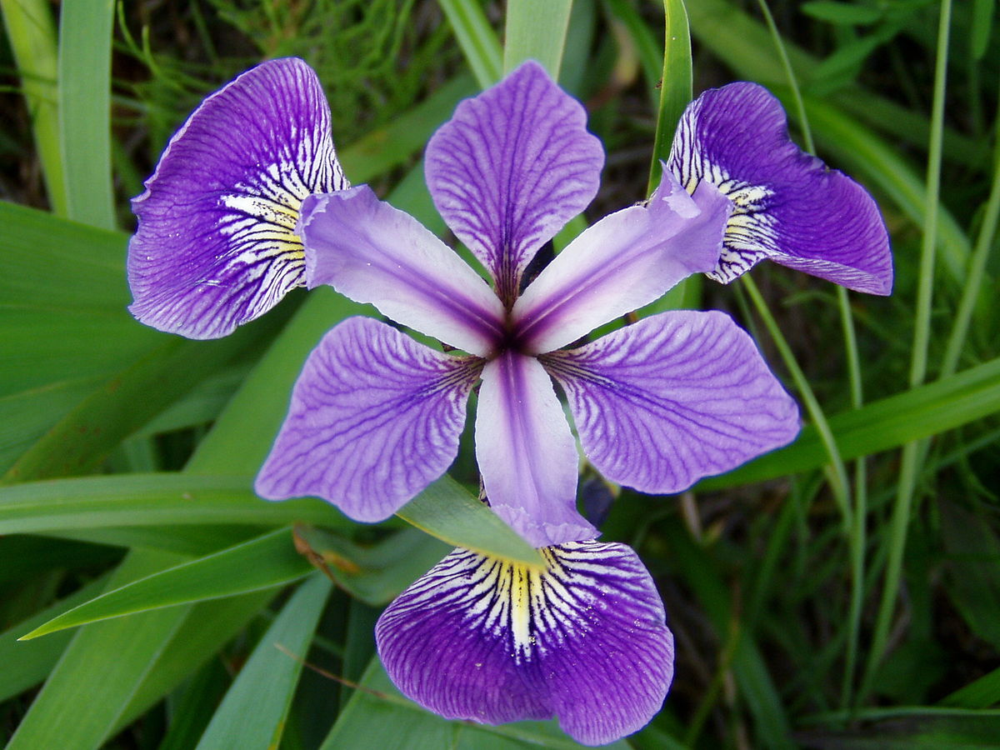

# Iris-Flower-Classification

### Table of Contents
1. [Installation](#installation)
2. [Project Overview](#project)
3. [File Descriptions](#files)
4. [Licensing, Authors, and Acknowledgements](#licensing)

## Installation 

All the librarires required to run the code are mentioned in [requirements.txt](https://github.com/rahul385/Iris-Flower-Classification/blob/master/requirements.txt). To install Run: `pip install -r requirements.txt`

## Project Overview

It is very basic classification problem which helps understand basic concept of Machine Learning. The objective of this project was to train a machine learning model to predict class of Iris flower provided with lengths & widths of the flower.

Three class for classification are as follows:
* Iris-setosa
* Iris-versicolor
* Iris-virginica

## File Descriptions 

* `Iris.csv` : The dataset for this project is downloaded from kaggle.com. The data set consists of 150 samples from each of three species of Iris (Iris setosa, Iris virginica and Iris versicolor). Four features were measured from each sample (in centimetres): Length of the sepals Width of the sepals Length of the petals Width of the petals

* `Iris.ipynb` : The jupyter notebook [Iris.ipynb](https://github.com/rahul385/Iris-Flower-Classification/blob/master/Iris.ipynb) includes data exploration, code, machine learning model and visualizations. I used the following classification algorithms to train the model and compared their accuracy.
  * Logistic Regression
  * Decision Tree
  * Random Forest
  * AdaBoost
  * XGBoost

I chose XGBoost as the final model for this project. The accuracy score was .977
  
* `Iris_Profile_Report.html` : Profiling report of the data set

* `Visualizations`: Includes all plots generated from the training data
   * `Correlation_Heatmap.png` : Correlation heatmap of all features
   * `pairplot.png` : Seaborn pairplot
   * `SepalWidth_Outliers.png` : Outliers detetcted for Sepal Width
   
## Screenshots

  ***Screenshot 1: Correlation Heatmap***
  

  ***Screenshot 2: Outliers in Sepal width***
  

## Licensing, Authors, Acknowledgements

Author: Rahul Gupta Copyright 2020

Permission is hereby granted, free of charge, to any person obtaining a copy of this software and associated documentation files (the "Software"), to deal in the Software without restriction, including without limitation the rights to use, copy, modify, merge, publish, distribute, sublicense, and/or sell copies of the Software, and to permit persons to whom the Software is furnished to do so, subject to the following conditions:

The above copyright notice and this permission notice shall be included in all copies or substantial portions of the Software.

THE SOFTWARE IS PROVIDED "AS IS", WITHOUT WARRANTY OF ANY KIND, EXPRESS OR IMPLIED, INCLUDING BUT NOT LIMITED TO THE WARRANTIES OF MERCHANTABILITY, FITNESS FOR A PARTICULAR PURPOSE AND NONINFRINGEMENT. IN NO EVENT SHALL THE AUTHORS OR COPYRIGHT HOLDERS BE LIABLE FOR ANY CLAIM, DAMAGES OR OTHER LIABILITY, WHETHER IN AN ACTION OF CONTRACT, TORT OR OTHERWISE, ARISING FROM, OUT OF OR IN CONNECTION WITH THE SOFTWARE OR THE USE OR OTHER DEALINGS IN THE SOFTWARE.
